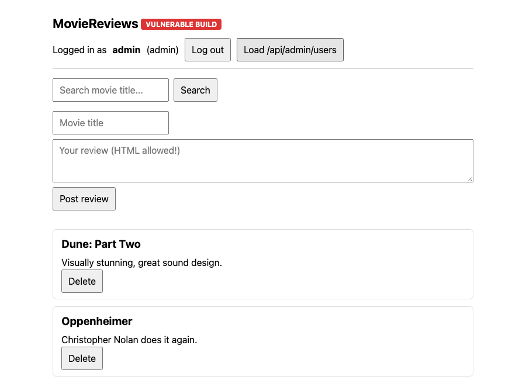
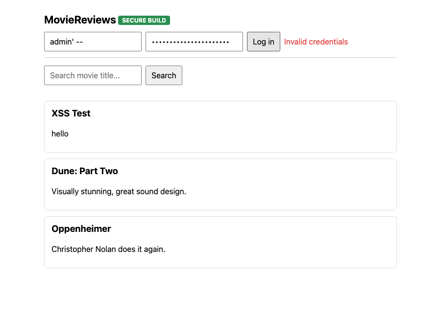
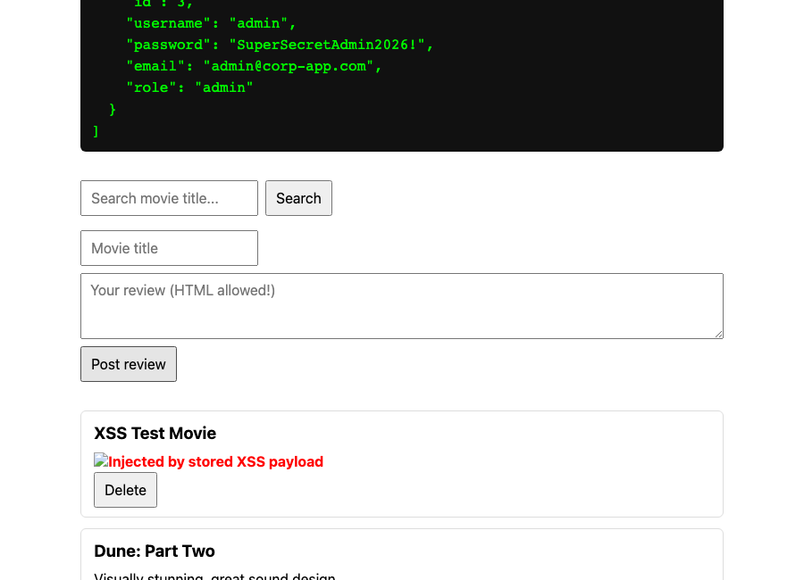
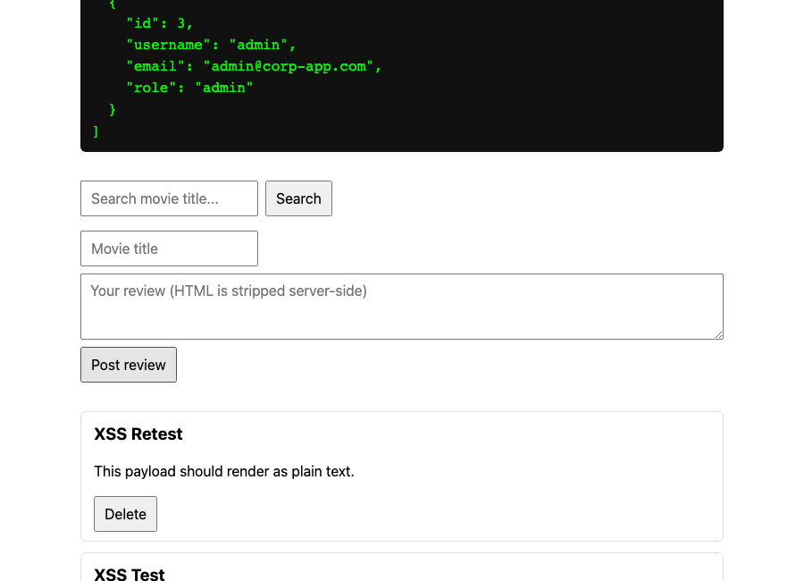
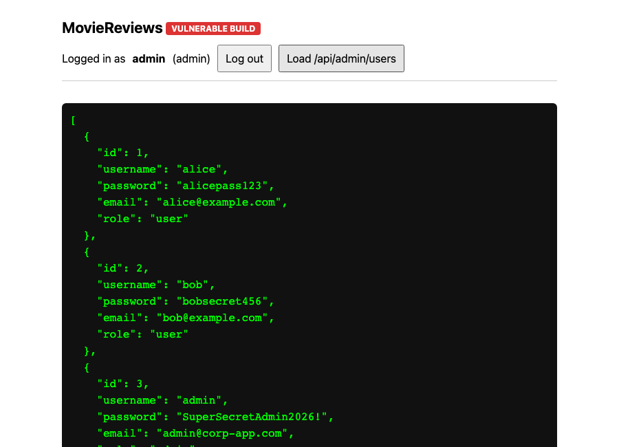
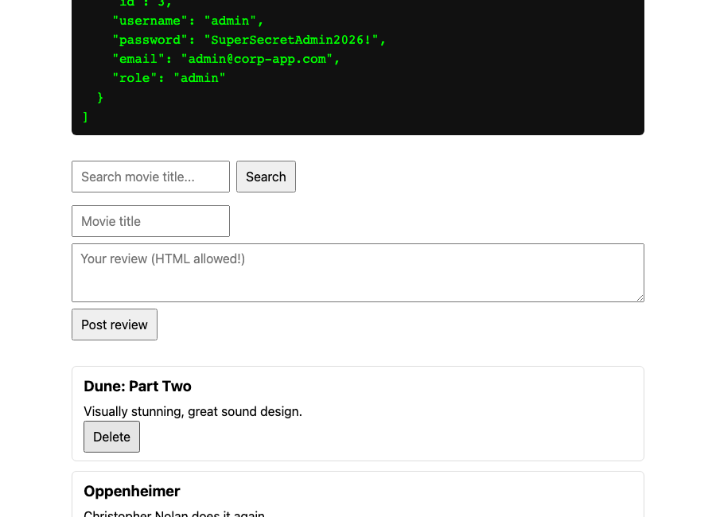
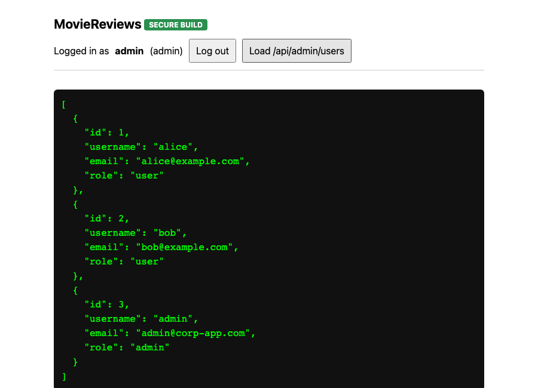

# Project 1 — Vulnerable-to-Secure Web App

A full-stack movie review app (React + Express + MySQL) built twice: once **intentionally
vulnerable** to 4 OWASP Top 10 issues, and once **fixed** with industry-standard controls.
Every exploit below was actually run against the live vulnerable app and actually re-run
against the live fixed app to confirm it now fails — nothing here is hypothetical.

This reuses the same stack (React / Node+Express / MySQL) as a prior coursework project
(a MySQL-backed movie review app), which is deliberate: the point of this project is
"I already knew how to build this app — so I went and broke it on purpose to learn the
attacker's side, then fixed it properly."

## Resume bullet

> Built and exploited a full-stack React/Node/MySQL application demonstrating 4 OWASP Top 10
> vulnerabilities (SQL injection, stored XSS, broken authentication, broken access control),
> then remediated each with parameterized queries, output sanitization, bcrypt password
> hashing, and JWT-based authorization — documenting the full attack-and-fix lifecycle with
> live exploit scripts and screenshots.

## Structure

```
01-vulnerable-web-app/
├── vulnerable/
│   ├── server/    # Express API, port 4000 — deliberately vulnerable
│   └── client/    # React (Vite) frontend, port 5173
├── secure/
│   ├── server/    # Same API, port 4001 — all 4 vulns fixed
│   └── client/    # Same React app, port 5174 — client-side hardening too
└── exploits/
    ├── capture_exploits.js   # Playwright script: runs all 4 exploits against :5173/:4000
    ├── capture_fixes.js      # Playwright script: re-runs them against :5174/:4001, confirms blocked
    └── screenshots/          # Real captured proof, numbered 1–8 in narrative order
```

## How to run it yourself

```bash
# 1. Start a local MySQL instance (adjust datadir/socket path as you like)
mysqld --initialize-insecure --datadir=/tmp/mysql-portfolio-data
mysqld --datadir=/tmp/mysql-portfolio-data --socket=/tmp/mysql-portfolio.sock --port=3309 &

# 2. Seed the vulnerable DB (plaintext passwords, on purpose)
mysql -u root --socket=/tmp/mysql-portfolio.sock < vulnerable/seed.sql   # see below for schema

# 3. Vulnerable branch
cd vulnerable/server && npm install && node server.js        # :4000
cd vulnerable/client && npm install && npm run dev            # :5173

# 4. Secure branch
cd secure/server && npm install && node init-db.js && node server.js   # seeds bcrypt DB, :4001
cd secure/client && npm install && npx vite --port 5174

# 5. Run the exploit walkthroughs
cd exploits && npm install && npx playwright install chromium
node capture_exploits.js   # against the vulnerable branch
node capture_fixes.js      # against the secure branch
```

Seed schema used for the vulnerable DB (`appdb`):

```sql
CREATE DATABASE appdb;
USE appdb;
CREATE TABLE users (
  id INT AUTO_INCREMENT PRIMARY KEY,
  username VARCHAR(50) UNIQUE NOT NULL,
  password VARCHAR(255) NOT NULL,   -- plaintext, on purpose (vuln #3)
  email VARCHAR(100) NOT NULL,
  role VARCHAR(20) NOT NULL DEFAULT 'user'
);
CREATE TABLE reviews (
  id INT AUTO_INCREMENT PRIMARY KEY,
  movie_title VARCHAR(200) NOT NULL,
  review_text TEXT NOT NULL,
  author_id INT NOT NULL,
  created_at TIMESTAMP DEFAULT CURRENT_TIMESTAMP
);
INSERT INTO users (username, password, email, role) VALUES
  ('alice', 'alicepass123', 'alice@example.com', 'user'),
  ('bob', 'bobsecret456', 'bob@example.com', 'user'),
  ('admin', 'SuperSecretAdmin2026!', 'admin@corp-app.com', 'admin');
INSERT INTO reviews (movie_title, review_text, author_id) VALUES
  ('Dune: Part Two', 'Visually stunning, great sound design.', 1),
  ('Oppenheimer', 'Christopher Nolan does it again.', 2);
```

---

## Vulnerability 1 — SQL Injection

**Vulnerable code** (`vulnerable/server/server.js`, `/api/login`):

```js
const query = `SELECT * FROM users WHERE username = '${username}' AND password = '${password}'`;
const [rows] = await pool.query(query);
```

Raw string concatenation means anything the client sends becomes part of the SQL statement.

**Exploit — classic auth bypass:**

```
username: admin' -- 
password: totally_wrong_password
```

The `--` comments out the password check entirely, so the query effectively becomes
`SELECT * FROM users WHERE username = 'admin'`. Real captured result:

```json
{"success":true,"user":{"id":3,"username":"admin","role":"admin"}}
```



**Exploit — UNION-based exfiltration** via `/api/reviews/search`:

```
GET /api/reviews/search?q=x' UNION SELECT id, username, password, role, NOW() FROM users -- 
```

Real captured result — the entire `users` table, including plaintext passwords, returned
through an endpoint that was only supposed to search movie titles:

```json
[
  {"id":1,"movie_title":"alice","review_text":"alicepass123","author_id":"user", ...},
  {"id":2,"movie_title":"bob","review_text":"bobsecret456","author_id":"user", ...},
  {"id":3,"movie_title":"admin","review_text":"SuperSecretAdmin2026!","author_id":"admin", ...}
]
```

**Fix** (`secure/server/server.js`) — parameterized queries throughout:

```js
const [rows] = await pool.query('SELECT * FROM users WHERE username = ?', [username]);
```

The placeholder (`?`) is sent to MySQL separately from the query template, so user input
is always treated as *data*, never as SQL syntax — no amount of quotes, dashes, or `UNION`
keywords in the input can change the query's structure.

**Re-run against the fix:**

```
$ curl -X POST :4001/api/login -d '{"username":"admin'\'' -- ","password":"anything"}'
{"success":false,"message":"Invalid credentials"}   # HTTP 401

$ curl ":4001/api/reviews/search?q=x' UNION SELECT ..."
[]   # no rows, no error, no leak
```



A deeper, focused version of this technique (including blind SQL injection) is in
[`../02-sql-injection-lab/`](../02-sql-injection-lab/).

---

## Vulnerability 2 — Stored XSS

**Vulnerable code** — `POST /api/reviews` stores `review_text` with zero sanitization, and
the React client renders it with `dangerouslySetInnerHTML`:

```jsx
<div dangerouslySetInnerHTML={{ __html: r.review_text }} />
```

**Exploit:** post a review containing:

```html
Injected by stored XSS payload</b>')">
```

Because the `` tag's `src` is invalid, the browser fires `onerror` immediately —
no user interaction needed, and this now runs for **every visitor** who loads the page,
not just the attacker. Captured proof (page title changed to `XSS-EXECUTED`, injected
red text rendered live):



**Fix** — two independent layers (defense in depth):
1. Server strips all HTML tags on write, via `sanitize-html`:
   ```js
   const cleanText = sanitizeHtml(review_text, { allowedTags: [], allowedAttributes: {} });
   ```
2. Client renders review text as plain text (`{r.review_text}`), never as raw HTML —
   React escapes it automatically, so even if something slipped past sanitization it still
   couldn't execute.

**Re-run against the fix:** the same payload is stored as inert text and never executes:



---

## Vulnerability 3 — Broken Authentication

**Vulnerable code:** passwords are stored and compared in **plaintext**:

```sql
SELECT * FROM users WHERE username = '...' AND password = '...'
```

If the `users` table ever leaks (e.g. via the SQLi above, or any future breach), every
password is immediately readable — no cracking required. There's also no session
mechanism at all: the server just hands back a user object, which the client stores as-is.

**Fix** (`secure/server/init-db.js`, `secure/server/server.js`):
- Passwords are hashed with **bcrypt** at cost factor 12 before storage:
  ```js
  const hash = await bcrypt.hash(plain, 12);
  ```
- Login compares against the hash, never the plaintext:
  ```js
  const ok = await bcrypt.compare(password, user.password_hash);
  ```
- A signed, expiring **JWT** (2h) replaces "hand back the user object" — every protected
  route now verifies a real cryptographic signature server-side instead of trusting
  whatever the client claims about itself.

Confirmed: the seeded `appdb_secure.users` table stores `$2b$12$...` bcrypt hashes, never
the original strings — see the captured `init-db.js` output in the setup section above.

---

## Vulnerability 4 — Broken Access Control

Two separate instances of this in the vulnerable build:

**4a — Client-controlled authorization.** `/api/admin/users` "checks" a role by reading a
header the *client itself* sets:

```js
if (req.headers['x-role'] !== 'admin') return res.status(403).json({ error: 'Forbidden' });
```

Any user — logged in or not — can set `x-role: admin` in devtools/curl/Burp and get the
full user table, including plaintext passwords:

```
$ curl :4000/api/admin/users -H "x-role: admin"
[{"id":1,"username":"alice","password":"alicepass123", ...}, ...]
```



**4b — Insecure Direct Object Reference (IDOR).** `DELETE /api/reviews/:id` has no
ownership check at all — anyone can delete anyone else's review just by knowing its id:



**Fix** (`secure/server/server.js`):
- Every protected route runs a `requireAuth` middleware that verifies the JWT signature
  server-side and attaches the *verified* `{ id, role }` to the request — the client can no
  longer simply declare its own role.
- Delete now checks real ownership:
  ```js
  if (review.author_id !== req.user.id && req.user.role !== 'admin') {
    return res.status(403).json({ error: 'Forbidden — you do not own this review' });
  }
  ```
- `/api/admin/users` checks `req.user.role` from the verified token, and no longer returns
  password hashes at all (belt-and-suspenders, on top of the auth fix).

**Re-run against the fix:** no token → `401 Missing token`. Real (non-admin or forged)
token → `403 Forbidden`. Legitimate admin token → succeeds, and returns no password data:



---

## What I'd add with more time

- Rate limiting on `/api/login` (the fix removes plaintext passwords and injection, but
  doesn't yet stop online brute-forcing of the bcrypt-hashed password itself).
- CSRF protection if this ever used cookie-based sessions instead of a bearer JWT.
- A Content-Security-Policy header as a third layer of XSS defense beyond sanitization +
  React's escaping.
- Refresh tokens / token revocation — the current JWT is stateless and can't be invalidated
  before its 2h expiry.
