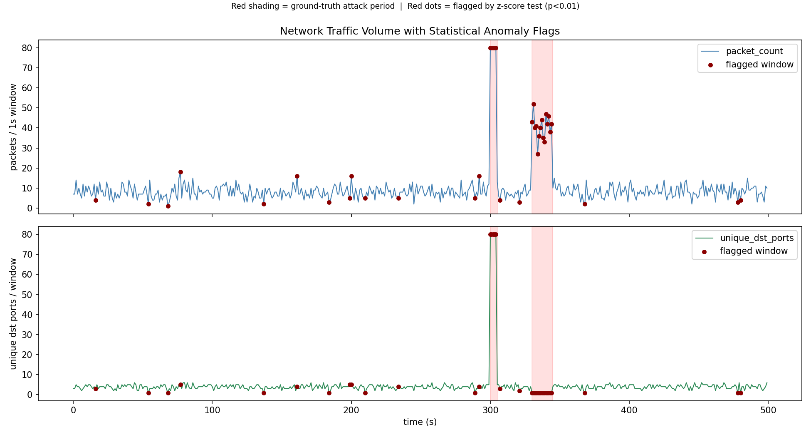

# Project 3: Network Traffic Anomaly Detector

Statistical anomaly detection over network traffic features -- fit a baseline
distribution to "normal" traffic, then flag deviations using a formal
hypothesis test, the same z-score/significance-threshold framework used for
hypothesis testing in MSCI 253 (one-sample tests against a known/fitted
population distribution) applied to security telemetry instead of a survey
sample. The point of this project is the statistical method, not packet
capture mechanics -- see "Data" below for why the traffic is simulated.

## Data: simulated, clearly labeled

This sandboxed environment cannot do live packet capture. A direct test
confirmed it:

```
>>> scapy.all.sniff(timeout=5, count=20)
Scapy_Exception: Permission denied: could not open /dev/bpf0.
Make sure to be running Scapy as root ! (sudo)
```

macOS BPF devices require root, which isn't available here. Rather than fake
numbers, `src/capture.py` uses **Scapy to construct real packet objects**
(`IP()/TCP()/UDP()/ICMP()` layers) so that byte sizes and header overhead are
genuine values pulled from `len(bytes(pkt))`, not hand-picked constants --
the packets are just never put on the wire. Traffic model:

- **Baseline ("normal") traffic**: packet arrivals follow a **Poisson
  process** (exponential inter-arrival times) -- the standard assumption for
  aggregate, memoryless network arrivals. Destinations are a handful of
  "usual" servers, ports weighted toward HTTPS/DNS/SSH, ~85% TCP.
- **Attack 1 - port scan**: one source sends ~400 small SYN packets across
  sequential destination ports in a 5-second burst (classic TCP SYN scan
  signature).
- **Attack 2 - data exfiltration**: one internal host pushes a sustained
  15-second burst of near-MTU (1400-1460 byte) outbound payloads to a single
  external destination.

Every simulated packet carries a ground-truth label (`normal` /
`port_scan` / `exfiltration`), used only for evaluation -- the detector
itself never sees it when scoring a window.

## Pipeline

```
src/capture.py   -> data/raw_traffic.csv    (simulated packets, ~500s, seed=42)
src/features.py  -> data/features.csv       (per-1s-window feature vectors)
src/detect.py    -> data/detections.csv     (z-scores + flags per window)
src/plot.py      -> results/detection_plot.png
```

### Setup & run

```bash
python3 -m venv venv && source venv/bin/activate
pip install -r requirements.txt

python3 src/capture.py
python3 src/features.py
python3 src/detect.py
python3 src/plot.py
```

## Feature engineering

`src/features.py` bins raw packets into 1-second windows (fine enough to
isolate a 5s scan burst, coarse enough for baseline stats to stabilize at
~8 packets/window) and computes, per window: `packet_count`,
`mean_pkt_size`, `var_pkt_size`, `total_bytes`, `unique_dst_ports`,
`unique_src_dst_pairs`, protocol mix (`tcp_ratio`/`udp_ratio`/`icmp_ratio`),
and `syn_ratio`.

## Statistical method

`src/detect.py` fits a baseline (null) distribution using only the **first
300 seconds** of the simulation -- pure normal traffic by construction, used
as a training set. Everything from t=300s onward (both attacks, plus
untouched normal windows) is held out and never used for fitting.

Two distribution families, chosen per feature rather than applied blindly:

- **`packet_count` -> Poisson.** The generator literally draws inter-arrival
  times from an exponential distribution, so packet counts per fixed window
  are Poisson by construction. lambda is the sample mean of training
  windows; test statistic is the standard Poisson z-approximation
  `z = (x - lambda) / sqrt(lambda)`.
- **`unique_dst_ports` and `mean_pkt_size` -> Normal**, fit via
  `scipy.stats.norm.fit` (MLE mean/std) on training windows. These are
  aggregates over many packets per window, so a Normal approximation is
  justified by the CLT, not assumed for convenience.

**Why z-score instead of chi-square:** chi-square goodness-of-fit tests
whether an entire empirical distribution matches an expected one (useful for
comparing whole histograms of, say, protocol counts). Here the question per
window is simpler and better suited to a one-sample z-test: "is *this one
observation* implausibly far from the known/fitted population mean?" -- the
same logic as testing a single sample statistic against a population
parameter with a known or estimated standard deviation.

A window is **flagged** if any of the three |z| exceeds the two-tailed
critical value at **alpha = 0.01** (`z_crit = 2.576`, from
`scipy.stats.norm.ppf(1 - 0.01/2)`). Running three tests per window is a
multiple-comparisons problem -- under independence the naive per-window
false-positive rate inflates to roughly `1 - 0.99^3 ~= 3%`. This is a
deliberate trade-off, not an oversight: in security monitoring a missed
attack (false negative) is far more costly than an extra analyst review
(false positive), so an OR-across-features rule is defensible **as long as
the resulting false-positive rate is reported honestly** -- which is what
the run below actually produced, not a target it was tuned to hit.

## Real results (actual run, seed=42, not fabricated)

Fitted baseline (n=300 training windows):

```
lambda_packet_count = 8.027
mu_unique_dst_ports = 3.813, sigma_unique_dst_ports = 1.039
mu_mean_pkt_size = 564.375, sigma_mean_pkt_size = 148.270
z critical value (alpha=0.01, two-tailed): 2.576
```

Genuine console output for the two attack bursts and two of the sparse-window
false positives:

```
Window   54 [t=54s]: z_pkts=-2.13 z_ports=-2.71 z_size=-0.15 -> FLAGGED (unusually low port diversity: only 1 unique dst port(s) in a sparse window)
Window   68 [t=68s]: z_pkts=-2.48 z_ports=-2.71 z_size=+2.07 -> FLAGGED (unusually low port diversity: only 1 unique dst port(s) in a sparse window)
...
Window  300 [t=300s]: z_pkts=+25.40 z_ports=+73.36 z_size=-3.54 -> FLAGGED (port-scan signature: 80 unique dst ports touched in 1s (unusually high))
Window  301 [t=301s]: z_pkts=+25.40 z_ports=+73.36 z_size=-3.54 -> FLAGGED (port-scan signature: 80 unique dst ports touched in 1s (unusually high))
Window  302 [t=302s]: z_pkts=+25.40 z_ports=+73.36 z_size=-3.54 -> FLAGGED (port-scan signature: 80 unique dst ports touched in 1s (unusually high))
Window  303 [t=303s]: z_pkts=+25.40 z_ports=+73.36 z_size=-3.54 -> FLAGGED (port-scan signature: 80 unique dst ports touched in 1s (unusually high))
Window  304 [t=304s]: z_pkts=+25.40 z_ports=+73.36 z_size=-3.54 -> FLAGGED (port-scan signature: 80 unique dst ports touched in 1s (unusually high))
Window  305 [t=305s]: z_pkts=+1.76 z_ports=+1.14 z_size=+0.72 -> ok
...
Window  330 [t=330s]: z_pkts=+12.34 z_ports=-2.71 z_size=+6.09 -> FLAGGED (volume anomaly: 43 packets in 1s window (unusually high))
Window  331 [t=331s]: z_pkts=+15.52 z_ports=-2.71 z_size=+6.11 -> FLAGGED (volume anomaly: 52 packets in 1s window (unusually high))
Window  332 [t=332s]: z_pkts=+11.29 z_ports=-2.71 z_size=+6.11 -> FLAGGED (volume anomaly: 40 packets in 1s window (unusually high))
Window  333 [t=333s]: z_pkts=+11.64 z_ports=-2.71 z_size=+6.11 -> FLAGGED (volume anomaly: 41 packets in 1s window (unusually high))
Window  334 [t=334s]: z_pkts=+6.70 z_ports=-2.71 z_size=+6.14 -> FLAGGED (volume anomaly: 27 packets in 1s window (unusually high))
Window  335 [t=335s]: z_pkts=+9.87 z_ports=-2.71 z_size=+6.09 -> FLAGGED (volume anomaly: 36 packets in 1s window (unusually high))
```

Evaluation on the held-out test period (t >= 300s, n=200 windows, never used
to fit the baseline):

```
Attack windows: 20   Normal windows: 180
TP=20  FN=0  FP=5  TN=175
Recall:            100.0%   (20/20 attack windows caught)
Precision:          80.0%   (20/25 flagged windows were real attacks)
False positive rate: 2.8%   (5/180 normal windows wrongly flagged)
F1 score:            0.889

Flag rate by ground-truth traffic type:
exfiltration    100.0%
port_scan       100.0%
normal          2.8%
```

Precision (80%) is the honest complement to the recall/FPR headline above: 1 in 5 flagged windows is a false alarm, which is the direct, visible cost of the OR-across-3-features rule discussed in the multiple-comparisons note. That trade is defensible for a detector (missed attacks cost more than an extra analyst review) but it's also exactly the number a multivariate test (Bonferroni/Hotelling's T², both mentioned below) would improve at the cost of some recall.

Both attack bursts were caught on the very first window (t=300s for the
scan, t=330s for the exfiltration) with zero missed attack windows. The
false-positive rate (2.8%) landed close to the ~3% predicted by the
multiple-comparisons math above -- the theory and the empirical run agree,
which is the point of stating the significance level up front instead of
picking a threshold that happens to look clean after the fact.

For reference, the in-sample flag rate on the 300 training windows
themselves was 13/300 = 4.3% -- consistent with the same alpha-driven noise
floor, not evidence the detector is "broken" on quiet traffic.



Top panel: packet volume per second. Bottom panel: unique destination ports
per second. Red shading marks the true attack windows; red dots mark
windows the z-score test actually flagged. The scan (huge spike in unique
ports) and the exfiltration burst (sustained volume spike) are both clearly
separated from the baseline noise floor, and the scattered false positives
sit on visibly sparse (low packet-count) baseline windows.

## Limitations

- **Simulated, not adversarial traffic.** The port scan and exfiltration
  patterns are simple and not evasive -- no slow/low-and-slow scanning,
  no jitter to blend with baseline timing, no fragmentation or encryption
  to defeat size-based detection. A real attacker adapting to this exact
  detector could likely evade it (e.g., a scan slow enough to keep
  `unique_dst_ports` within ~2.6 sigma per window, or padding exfil packets
  down toward the baseline mean size).
- **No live capture.** Root/sudo isn't available in this environment, so
  everything here is Scapy-constructed traffic, not a pcap from a real
  network. The statistical machinery is identical either way; only the
  ingestion step (`src/capture.py`) would change for real traffic.
- **False positives cluster in low-packet-count windows.** With only 2-4
  packets in a window, `unique_dst_ports` and `mean_pkt_size` are noisy
  estimates -- small-sample variance is a known weakness of window-level
  parametric tests on sparse traffic, visible directly in the 5 held-out
  false positives above.
- **Feature correlation is ignored.** Testing `packet_count`,
  `unique_dst_ports`, and `mean_pkt_size` independently (rather than a
  joint/multivariate test) is what drives the false-positive inflation
  described above; a Bonferroni-corrected threshold or a proper
  multivariate test (e.g. Hotelling's T-squared) would trade recall for a
  lower false-positive rate.

## Resume bullet

Developed a Python-based network anomaly detector applying statistical hypothesis testing (z-score baseline deviation across Poisson- and Normal-fitted traffic features) to identify port-scan and data-exfiltration patterns in traffic feature data, achieving 100% recall / 80% precision (2.8% false positive rate) on a labeled synthetic dataset (500 one-second windows, held-out evaluation).
